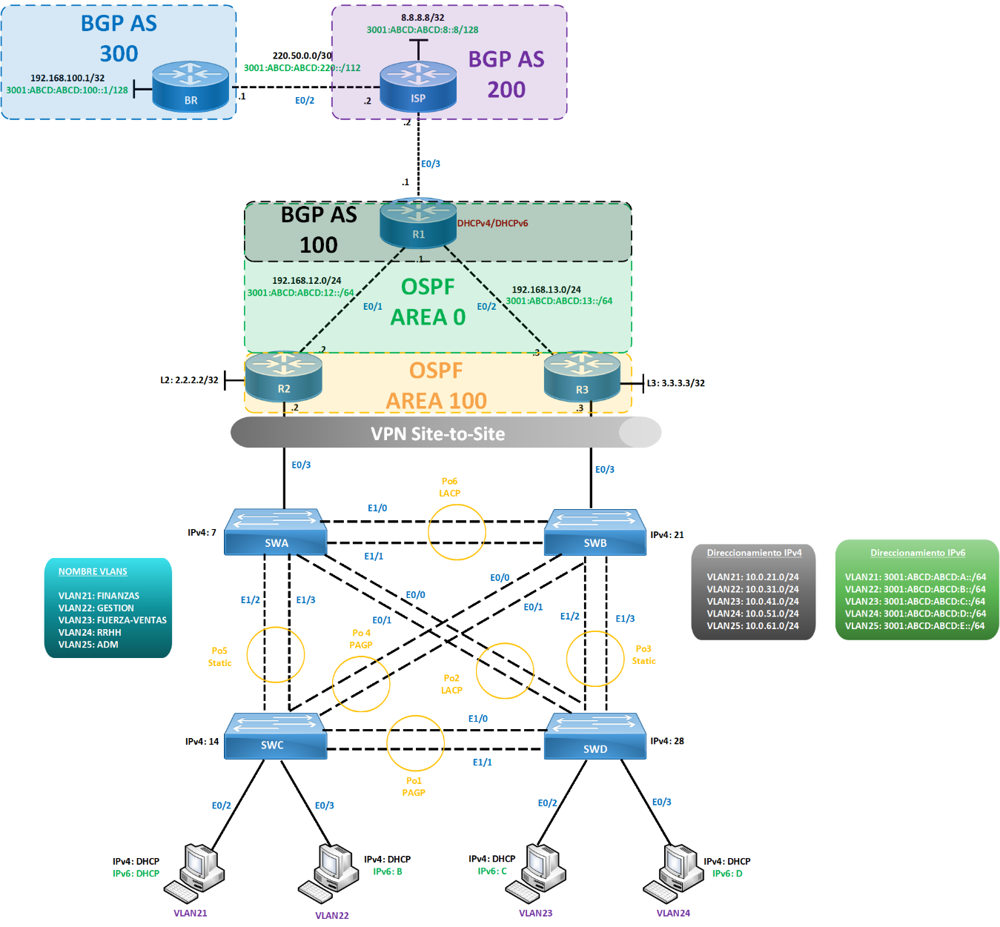

# Lab 3.3.2 / Laboratorio N°15 — Implementación de Seguridad sobre Túneles

> Fuente: `3.3.2 Actividad Implementación de Seguridad sobre Tuneles.docx`  
> IULab import: `3.3.3 Laboratorio Implementación de Seguridad sobre Tuneles.gz` (tu parte)  
> Título IULab: **Laboratorio N°15: Implementación de Seguridad sobre Túneles**

## Metadatos de la actividad

| Campo | Valor |
|-------|-------|
| Sigla | ARY5112 |
| Asignatura | Routing y Switching Corporativo |
| Tiempo | 3 horas |
| Experiencia de aprendizaje | N° 3 — Alta Disponibilidad, Seguridad, Virtualización y Automatización de Redes Corporativas |
| Actividad | N° 3.3 — Implementación de Seguridad sobre Túneles |
| Recurso didáctico | 3.3.2 Actividad Implementación de Seguridad sobre Túneles |

## Datos de conexión

| Dispositivo | Rol | IP de gestión | Puerto | Usuario | Contraseña | Método de acceso |
|-------------|-----|---------------|--------|---------|------------|------------------|
| R1 | Router frontera / DHCP server | 192.168.78.128 | 2001 | | | Telnet |
| R2 | Router OSPF ABR / VPN peer | 192.168.78.128 | 2002 | | | Telnet |
| R3 | Router OSPF ABR / VPN peer | 192.168.78.128 | 2003 | | | Telnet |
| ISP | Router BGP AS 200 | 192.168.78.128 | 2004 | | | Telnet |
| SWA | Switch distribución | 192.168.78.128 | 2005 | | | Telnet |
| SWB | Switch distribución | 192.168.78.128 | 2006 | | | Telnet |
| SWC | Switch acceso | 192.168.78.128 | 2007 | | | Telnet |
| SWD | Switch acceso | 192.168.78.128 | 2008 | | | Telnet |
| BR | Router BGP AS 300 | 192.168.78.128 | 2013 | | | Telnet |

## Resultados de Aprendizajes e Indicadores de Logro

- **Resultado de Aprendizaje RA3:** Implementa tecnologías de alta disponibilidad de capa 3, seguridad en redes, virtualización y automatización, logrando una eficiencia operativa y de administración al interior de una red corporativa.
- **Indicador IL3.3:** Diseña seguridad de red para la protección de los datos que transitan entre sitios.

## Descripción General de la Actividad

- Esta actividad busca poner en práctica los contenidos prácticos vistos durante la clase. Es importante preguntar a tu docente sobre las dudas y/o consultas que vayas realizando.
- Es importante guardar los cambios de manera constante.
- Realizar las configuraciones solicitadas, y responder las preguntas planteadas.
- Una vez finalizada la actividad, deberá ser enviada a través del AVA, según las instrucciones del docente.

## Descripción Específica de la Actividad

En esta actividad se busca que los estudiantes implementen una red corporativa de capa 2 y capa 3, con varias tecnologías realizadas en laboratorios anteriores, además de la implementación de tecnologías de seguridad de capa 2 y capa 3 que permitan mantener la continuidad operacional de una red corporativa.

## Topología a Configurar

A continuación, se presenta la topología de red a configurar:

> Ver detalle completo de interfaces, conectividad, EtherChannels y protocolos en [`topology-detail.md`](topology-detail.md).

### Direccionamiento IPv4 / IPv6 por VLAN

| VLAN | Nombre | IPv4 | IPv6 |
|------|--------|------|------|
| 21 | FINANZAS | 10.0.21.0/24 | 3001:ABCD:ABCD:A::/64 |
| 22 | GESTIÓN | 10.0.31.0/24 | 3001:ABCD:ABCD:B::/64 |
| 23 | FUERZA-VENTAS | 10.0.41.0/24 | 3001:ABCD:ABCD:C::/64 |
| 24 | RRHH | 10.0.51.0/24 | 3001:ABCD:ABCD:D::/64 |
| 25 | ADM | 10.0.61.0/24 | 3001:ABCD:ABCD:E::/64 |

### Loopbacks y enlaces WAN relevantes

| Dispositivo | Concepto | Valor |
|-------------|----------|-------|
| BR | Loopback IPv4 / IPv6 | 192.168.100.1/32 / 3001:ABCD:ABCD:100::1/128 |
| ISP | Loopback IPv4 / IPv6 | 8.8.8.8/32 / 3001:ABCD:ABCD:8:8::/128 |
| BR ↔ ISP | Enlace punto a punto | 220.50.0.0/30 / 3001:ABCD:ABCD:220::/112 |
| R2 | Loopback | 2.2.2.2/32 |
| R3 | Loopback | 3.3.3.3/32 |
| R1 ↔ R2 | Enlace | 192.168.12.0/24 / 3001:ABCD:ABCD:12::/64 |
| R1 ↔ R3 | Enlace | 192.168.13.0/24 / 3001:ABCD:ABCD:13::/64 |

### Observaciones del diagrama

- **BGP:** AS 100 (R1, R2, R3) se conecta al ISP en AS 200; el BR pertenece al AS 300.
- **OSPF:** Área 0 entre R1-R2 y R1-R3; Área 100 entre R2-R3.
- **Capa 2:** SWA y SWB son switches de distribución; SWC y SWD son switches de acceso.
- **EtherChannels:** Po1 PAgP (SWC-SWD), Po2 LACP (SWB-SWC), Po3 Static (SWB-SWD), Po4 PAgP (SWA-SWD), Po5 Static (SWA-SWC), Po6 LACP (SWA-SWB).
- **DHCP:** Los PCs de las VLAN 21-24 reciben IPv4/IPv6 por DHCP; R1 actúa como servidor DHCPv4/DHCPv6.
- **VPN Site-to-Site:** El túnel corre entre R2 y R3 sobre el backbone de capa 2.

## Requerimientos
- Crear dominios de broadcast en todos los equipos propuestos, según ID y nombres propuestos.
- Implementar agregado de enlace en base a los números de grupos solicitados.
- Habilitar PVST+ Rápido en todos los equipos de capa 2 de la topología.
- En los switches de acceso implementar algún tipo de seguridad donde aprenda un máximo de 2 direcciones MAC, desactivando el puerto en caso de error.
- En interfaces apropiadas, implementar mecanismos de estabilización de STP.
- VLAN21 no debe comunicarse con VLAN22 mediante PACL.
- VLAN23 no debe comunicarse con VLAN24 mediante VACL.
- Implementar enrutamiento intervlan tanto en R2 como R3.
- Implementar alta disponibilidad de capa 3, donde el tráfico de la VLAN21 y VLAN22 prefiera R2 y la VLAN23 y VLAN24 prefiera R3. Utilizar la ultima IP asignable como default-gateway para IPv4 y para IPv6 la ::FF.
- Implementar una VPN Site-to-Site entre R2 y R3. Utilizar parámetros a elección.
- Implementar protocolo de estado de enlace a nivel de IPv4/IPv6.
- Sumarizar las rutas del área 100, las cuales deben verse reflejadas en el área 0.
- Implementar MP-BGP, según AS correpondiente. Las loopbacks debe actuar como prefijos para este protocolo de enrutamiento.
- Influenciar atributo enlace entre ISP y BR, a través de route-map para que path aparezca con dos AS 200 en IPv4 y tres AS 200 en IPv6.
- Realizar la redistribución entre IGP y EGP para ambos protocolos de enrutamiento a nivel de IPv4/IPv6.
- Comprobar conectividad completa en IPv4/IPv6.

## Preguntas
- ¿Qué utilidad tiene una VPN Site-to-Site?
- ¿Qué soluciones de SD-WAN conoce o ha escuchado?

## Inventario de imágenes extraídas

| Archivo | Tamaño | Uso |
|---------|--------|-----|
| `image2.png` | 310595 bytes | **Topología principal del laboratorio** |
| `image1.gif` | 663 bytes | Logo institucional (icono) |
| `image3.png` | 20627 bytes | Logo institucional (texto) |
| `image4.jpeg` | 44732 bytes | Fondo/plantilla de página |
